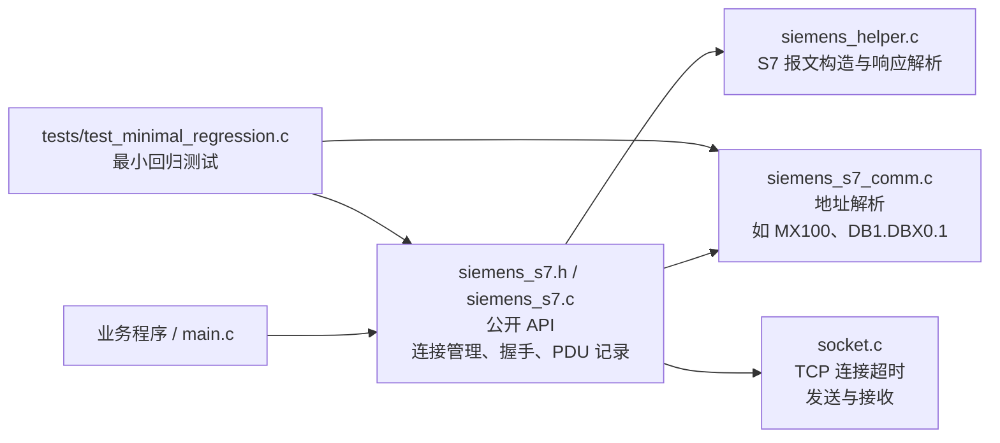
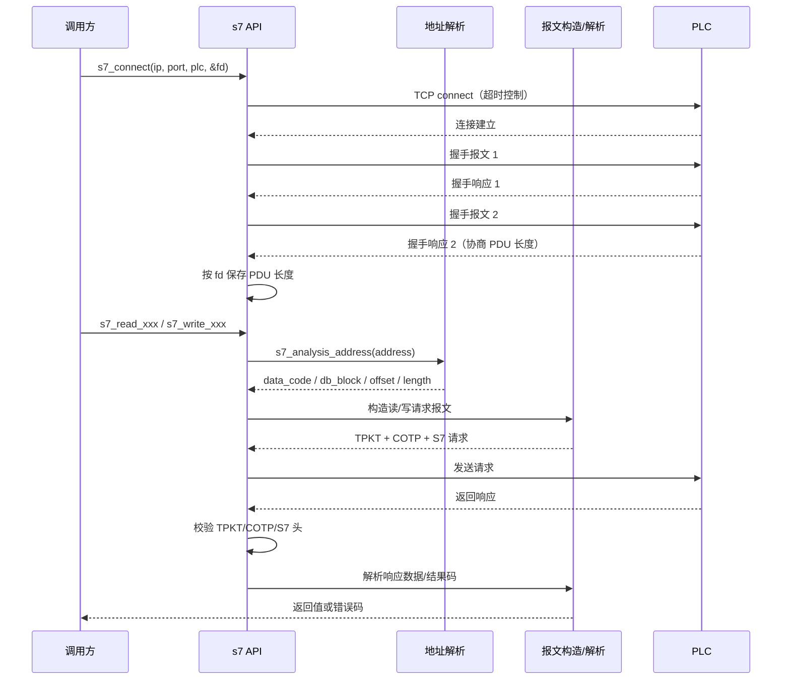
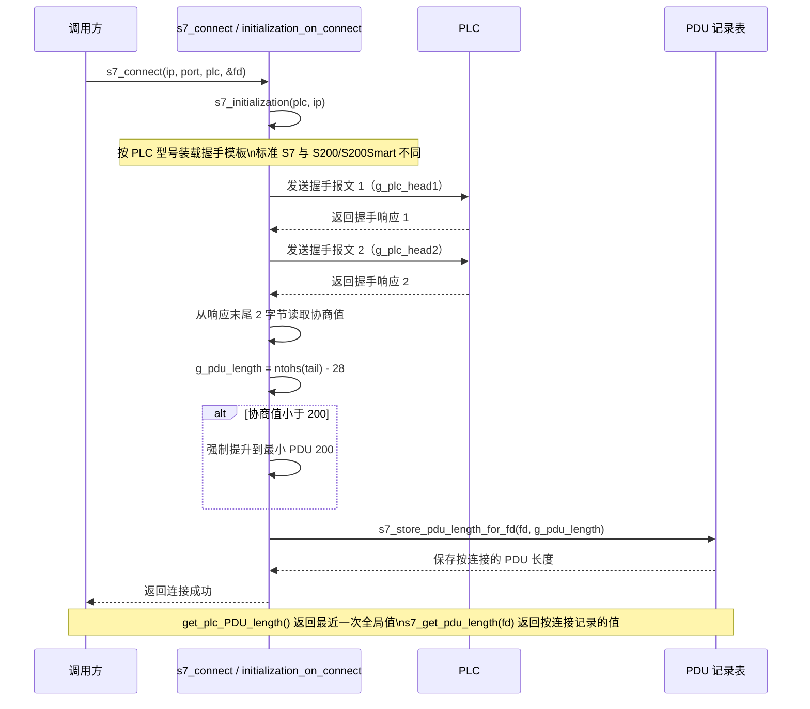
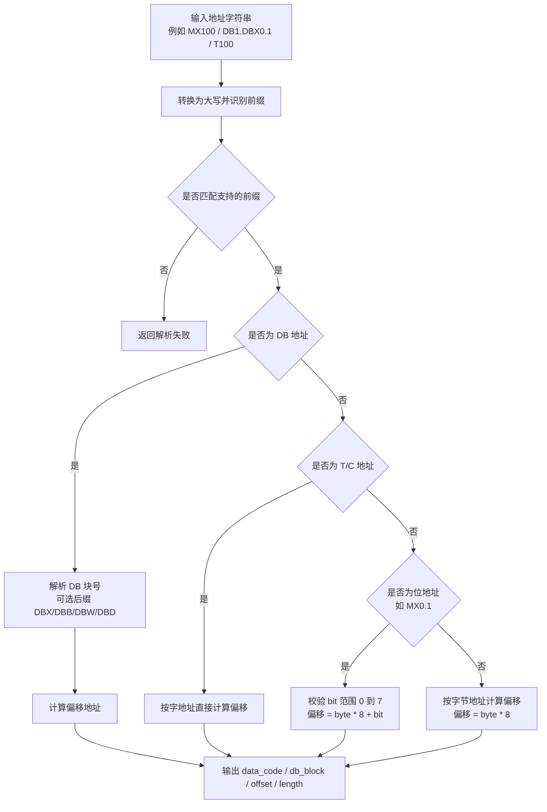

# 程序整体介绍

[English README](README_EN.md)

## 版权与作者信息

- 开源协议：MIT License
- GitHub：iceman
- 邮箱：[wqliceman@gmail.com](mailto:wqliceman@gmail.com)

- 项目名称：siemens_plc_s7_net
- 开发语言：C语言
- 支持操作系统：windows/linux
- 测试设备：S1200

目前实现功能，实现西门子PLC通讯类，采用S7协议实现，需要在PLC侧先的以太网模块先进行配置。

## 最近优化（2026-03）

- 连接模型升级：TCP 连接改为非阻塞 `connect + select` 超时机制，避免阻塞连接导致的不稳定。
- 协议读取增强：`s7_read_response` 新增 TPKT/COTP/S7 头字段校验，不再只做长度判断。
- 地址解析增强：支持并验证边界地址，如 `DB1.DBX0.1`、`T100`、`C100`。
- 地址解析增强：严格拒绝非法地址，如空字符串、`MX0.8`、`MX0.A`。
- fd 判定统一：内部统一使用 `fd < 0` 作为无效句柄，避免误判 `fd == 0`。
- 新增最小回归测试：覆盖地址解析边界、TPKT 短包保护、remote run/stop 报文内容校验。

## 构建与测试

Linux/WSL 下推荐命令：

```bash
# 主程序构建
make

# 回归测试构建
make tests

# 执行回归测试
./tests/test_minimal_regression
```

Windows PowerShell 调用 WSL 示例：

```powershell
wsl.exe bash -lc 'cd /mnt/e/GitHub/siemens_plc_s7_net && make clean && make && make tests && ./tests/test_minimal_regression'
```

说明：顶层 `make` 默认只构建主程序；测试通过 `make tests` 显式触发，避免构建产物冲突。

## 架构概览

当前代码可以按“公开接口 -> 地址解析 -> 报文构造/解析 -> Socket 传输”来理解。首次接入时，先看这几个模块的职责边界，比直接阅读全部 API 原型更高效。



## 连接与读写流程

库的核心路径不是单个 API，而是“连接握手 + 地址解析 + 报文收发 + 响应校验”这一整条链路。下面这张图用于快速建立调用心智模型。



### PDU 协商细化流程

连接阶段真正需要注意的细节在第二次握手：库会按 PLC 家族加载不同握手模板，从返回报文尾部提取协商后的 PDU 长度，并同时更新兼容的全局值与按连接保存的映射。



## 头文件

```c
#include "siemens_s7.h"  //协议提供方法接口
#include "typedef.h"   //部分类型宏定义
```

## 西门子PLC地址说明

### 连接属性

- port: 端口号，通常为102
- plc_type: plc型号，S200、S200Smart、S300、S400、S1200、S1500

### PLC地址分类

类型的代号值（软元件代码，用于区分软元件类型，如：D，R）

| 序号 | 描述           | 地址类型 |
| :--: | :------------- | :------: |
| 1    | 中间继电器     | M        |
| 2    | 输入继电器     | I        |
| 3    | 输出继电器 Q   | Q        |
| 4    | DB 块寄存器 DB | DB       |
| 5    | V 寄存器       | V        |
| 6    | 定时器的值     | T        |
| 7    | 计数器的值     | C        |
| 8    | 智能输入寄存器 | AI       |
| 9    | 智能输出寄存器 | AQ       |

### 地址解析流程

地址字符串会先按前缀分类，再根据是否为 DB 地址、位地址或定时器/计数器地址，计算最终的访问偏移。



## 实现方法

### 1.连接PLC设备

```c
bool s7_connect(char* ip_addr, int port, siemens_plc_types_e plc, int* fd);
/* 连接PLC设备
 * 参数:
 *   ip_addr: PLC的IP地址
 *   port: PLC的端口号
 *   plc: PLC的型号
 *   fd: 连接成功后返回的文件描述符
 * 返回值:
 *   连接成功返回true，失败返回false
 */

bool s7_disconnect(int fd);
/* 断开与PLC的连接
 * 参数:
 *   fd: 连接PLC的文件描述符
 * 返回值:
 *   成功返回true，失败返回false
 */

byte get_plc_slot();
/* 获取PLC的槽号
 * 返回值:
 *   PLC的槽号
 */

void set_plc_slot(byte slot);
/* 设置PLC的槽号
 * 参数:
 *   slot: 要设置的槽号
 */

byte get_plc_rack();
/* 获取PLC的机架号
 * 返回值:
 *   PLC的机架号
 */

void set_plc_rack(byte rack);
/* 设置PLC的机架号
 * 参数:
 *   rack: 要设置的机架号
 */

byte get_plc_connection_type();
/* 获取PLC的连接类型
 * 返回值:
 *   PLC的连接类型
 */

void set_plc_connection_type(byte rack);
/* 设置PLC的连接类型
 * 参数:
 *   rack: 要设置的连接类型
 */

int get_plc_local_TSAP();
/* 获取PLC的本地TSAP
 * 返回值:
 *   PLC的本地TSAP
 */

void set_plc_local_TSAP(int tasp);
/* 设置PLC的本地TSAP
 * 参数:
 *   tasp: 要设置的本地TSAP
 */

int get_plc_dest_TSAP();
/* 获取PLC的目标TSAP
 * 返回值:
 *   PLC的目标TSAP
 */

void set_plc_dest_TSAP(int tasp);
/* 设置PLC的目标TSAP
 * 参数:
 *   tasp: 要设置的目标TSAP
 */

int get_plc_PDU_length();
/* 获取PLC的PDU长度
 * 返回值:
 *   PLC的PDU长度
 */

int s7_get_pdu_length(int fd);
/* 按连接获取PLC的PDU长度
 * 参数:
 *   fd: 连接PLC的文件描述符
 * 返回值:
 *   该连接协商后的PDU长度；若连接未知则返回0
 */
```

### 2.读取数据

```c
S7_error_code_e s7_read_bool(int fd, const char* address, bool* val);
/* 从PLC读取布尔值数据
 * 参数:
 *   fd: 连接PLC的文件描述符
 *   address: 数据在PLC中的地址
 *   val: 用于接收读取到的数据的指针
 * 返回值:
 *   读取成功返回S7_ERROR_CODE_SUCCESS，否则返回相应的错误码
 */

s7_error_code_e s7_read_byte(int fd, const char* address, byte* val);
/* 从PLC读取字节数据
 * 参数同上，此处省略...
 */

s7_error_code_e s7_read_short(int fd, const char* address, short* val);
/* 从PLC读取短整型数据
 * 参数同上，此处省略...
 */

s7_error_code_e s7_read_ushort(int fd, const char* address, ushort* val);
/* 从PLC读取无符号短整型数据
 * 参数同上，此处省略...
 */

s7_error_code_e s7_read_int32(int fd, const char* address, int32* val);
/* 从PLC读取32位整型数据
 * 参数同上，此处省略...
 */

s7_error_code_e s7_read_uint32(int fd, const char* address, uint32* val);
/* 从PLC读取无符号32位整型数据
 * 参数同上，此处省略...
 */

s7_error_code_e s7_read_int64(int fd, const char* address, int64* val);
/* 从PLC读取64位整型数据
 * 参数同上，此处省略...
 */

s7_error_code_e s7_read_uint64(int fd, const char* address, uint64* val);
/* 从PLC读取无符号64位整型数据
 * 参数同上，此处省略...
 */

s7_error_code_e s7_read_float(int fd, const char* address, float* val);
/* 从PLC读取浮点型数据
 * 参数同上，此处省略...
 */

s7_error_code_e s7_read_double(int fd, const char* address, double* val);
/* 从PLC读取双精度浮点型数据
 * 参数同上，此处省略...
 */

s7_error_code_e s7_read_string(int fd, const char* address, int length, char** val); 
/* 从PLC读取字符串数据，需要手动释放返回的字符串内存
 * 参数:
 *   fd: 连接PLC的文件描述符
 *   address: 数据在PLC中的地址
 *   length: 要读取的字符串长度
 *   val: 用于接收读取到的字符串的指针，使用后需释放内存
 * 返回值:
 *   读取成功返回S7_ERROR_CODE_SUCCESS，否则返回相应的错误码
 */
```

### 3.写入数据

```c
s7_error_code_e s7_write_bool(int fd, const char* address, bool val);
/* 向PLC写入布尔值数据
 * 参数同上，此处省略...
 */

s7_error_code_e s7_write_byte(int fd, const char* address, byte val);
/* 向PLC写入字节数据
 * 参数同上，此处省略...
 */

s7_error_code_e s7_write_short(int fd, const char* address, short val);
/* 向PLC写入短整型数据
 * 参数同上，此处省略...
 */

s7_error_code_e s7_write_ushort(int fd, const char* address, ushort val);
/* 向PLC写入无符号短整型数据
 * 参数同上，此处省略...
 */

s7_error_code_e s7_write_int32(int fd, const char* address, int32 val);
/* 向PLC写入32位整型数据
 * 参数同上，此处省略...
 */

s7_error_code_e s7_write_uint32(int fd, const char* address, uint32 val);
/* 向PLC写入无符号32位整型数据
 * 参数同上，此处省略...
 */

s7_error_code_e s7_write_int64(int fd, const char* address, int64 val);
/* 向PLC写入64位整型数据
 * 参数同上，此处省略...
 */

s7_error_code_e s7_write_uint64(int fd, const char* address, uint64 val);
/* 向PLC写入无符号64位整型数据
 * 参数同上，此处省略...
 */

s7_error_code_e s7_write_float(int fd, const char* address, float val);
/* 向PLC写入浮点型数据
 * 参数同上，此处省略...
 */

s7_error_code_e s7_write_double(int fd, const char* address, double val);
/* 向PLC写入双精度浮点型数据
 * 参数同上，此处省略...
 */

s7_error_code_e s7_write_string(int fd, const char* address, int length, const char* val);
/* 向PLC写入字符串数据
 * 参数:
 *   fd: 连接PLC的文件描述符
 *   address: 数据在PLC中的地址
 *   length: 要写入的字符串长度
 *   val: 要写入的字符串
 * 返回值:
 *   写入成功返回S7_ERROR_CODE_SUCCESS，否则返回相应的错误码
 */
```

## 使用样例

完整样例参见代码中**main.c**文件，如下提供主要代码和使用方法：

*读取地址，格式为"**M100**","**DB100**"

```c
#ifdef _WIN32
#include <WinSock2.h>
#endif
#include <stdio.h>
#include <stdlib.h>
#pragma warning( disable : 4996)

#define GET_RESULT(ret){ if(!ret) faild_count++; }

#include "siemens_s7.h"

int main(int argc, char** argv)
{
#ifdef _WIN32
 WSADATA wsa;
 if (WSAStartup(MAKEWORD(2, 2), &wsa) != 0)
 {
  return -1;
 }
#endif

 char* plc_ip = "192.168.123.170";
 int plc_port = 102;
 if (argc > 1)
 {
  plc_ip = argv[1];
  plc_port = atoi(argv[2]);
 }

 int fd = -1;
 bool ret = s7_connect(plc_ip, plc_port, S1200, &fd);
 if (ret && fd > 0)
 {
  s7_error_code_e ret = S7_ERROR_CODE_FAILED;

  char* type = s7_read_plc_type(fd);
  printf("plc type: %s\n", type);
  free(type);

  const int TEST_COUNT = 5000;
  const int TEST_SLEEP_TIME = 1000;
  int faild_count = 0;
  char address[50] = { 0 };
  int i = 0;

  for (i = 0; i < TEST_COUNT; i++)
  {
   printf("==============Test count: %d==============\n", i + 1);
   bool all_success = false;
   //////////////////////////////////////////////////////////////////////////
   bool val = true;
   strcpy(address, "MX100");
   ret = s7_write_bool(fd, address, val);
   printf("Write\t %s \tbool:\t %d, \tret: %d\n", address, val, ret);
   GET_RESULT(ret);

   val = false;
   ret = s7_read_bool(fd, address, &val);
   printf("Read\t %s \tbool:\t %d\n", address, val);
   GET_RESULT(ret);

   //////////////////////////////////////////////////////////////////////////
   short w_s_val = 23;
   strcpy(address, "MW100");
   ret = s7_write_short(fd, address, w_s_val);
   printf("Write\t %s \tshort:\t %d, \tret: %d\n", address, w_s_val, ret);
   GET_RESULT(ret);

   short s_val = 0;
   ret = s7_read_short(fd, address, &s_val);
   printf("Read\t %s \tshort:\t %d\n", address, s_val);
   GET_RESULT(ret);

   //////////////////////////////////////////////////////////////////////////
   ushort w_us_val = 255;
   strcpy(address, "MW100");
   ret = s7_write_ushort(fd, address, w_us_val);
   printf("Write\t %s \tushort:\t %d, \tret: %d\n", address, w_us_val, ret);
   GET_RESULT(ret);

   ushort us_val = 0;
   ret = s7_read_ushort(fd, address, &us_val);
   printf("Read\t %s \tushort:\t %d\n", address, us_val);
   GET_RESULT(ret);

   //////////////////////////////////////////////////////////////////////////
   int32 w_i_val = 12345;
   strcpy(address, "DB1.70");
   ret = s7_write_int32(fd, address, w_i_val);
   printf("Write\t %s \tint32:\t %d, \tret: %d\n", address, w_i_val, ret);
   GET_RESULT(ret);

   int i_val = 0;
   ret = s7_read_int32(fd, address, &i_val);
   printf("Read\t %s \tint32:\t %d\n", address, i_val);
   GET_RESULT(ret);

   //////////////////////////////////////////////////////////////////////////
   uint32 w_ui_val = 22345;
   ret = s7_write_uint32(fd, address, w_ui_val);
   printf("Write\t %s \tuint32:\t %d, \tret: %d\n", address, w_ui_val, ret);
   GET_RESULT(ret);

   uint32 ui_val = 0;
   ret = s7_read_uint32(fd, address, &ui_val);
   printf("Read\t %s \tuint32:\t %d\n", address, ui_val);
   GET_RESULT(ret);

   //////////////////////////////////////////////////////////////////////////
   int64 w_i64_val = 333334554;
   strcpy(address, "DB1.DBW70");
   ret = s7_write_int64(fd, address, w_i64_val);
   printf("Write\t %s \tuint64:\t %lld, \tret: %d\n", address, w_i64_val, ret);
   GET_RESULT(ret);

   int64 i64_val = 0;
   ret = s7_read_int64(fd, address, &i64_val);
   printf("Read\t %s \tint64:\t %lld\n", address, i64_val);
   GET_RESULT(ret);

   //////////////////////////////////////////////////////////////////////////
   uint64 w_ui64_val = 4333334554;
   strcpy(address, "DB1.DBW70");
   ret = s7_write_uint64(fd, address, w_ui64_val);
   printf("Write\t %s \tuint64:\t %lld, \tret: %d\n", address, w_ui64_val, ret);
   GET_RESULT(ret);

   int64 ui64_val = 0;
   ret = s7_read_uint64(fd, address, &ui64_val);
   printf("Read\t %s \tuint64:\t %lld\n", address, ui64_val);
   GET_RESULT(ret);

   //////////////////////////////////////////////////////////////////////////
   float w_f_val = 32.454f;
   strcpy(address, "DB1.DBW70");
   ret = s7_write_float(fd, address, w_f_val);
   printf("Write\t %s \tfloat:\t %f, \tret: %d\n", address, w_f_val, ret);
   GET_RESULT(ret);

   float f_val = 0;
   ret = s7_read_float(fd, address, &f_val);
   printf("Read\t %s \tfloat:\t %f\n", address, f_val);
   GET_RESULT(ret);

   //////////////////////////////////////////////////////////////////////////
   double w_d_val = 12345.6789;
   ret = s7_write_double(fd, address, w_d_val);
   printf("Write\t %s \tdouble:\t %lf, \tret: %d\n", address, w_d_val, ret);
   GET_RESULT(ret);

   double d_val = 0;
   ret = s7_read_double(fd, address, &d_val);
   printf("Read\t %s \tdouble:\t %lf\n", address, d_val);
   GET_RESULT(ret);

   //////////////////////////////////////////////////////////////////////////
   const char sz_write[] = "wqliceman@gmail.com";
   int length = sizeof(sz_write) / sizeof(sz_write[0]);
   ret = s7_write_string(fd, address, length, sz_write);
   printf("Write\t %s \tstring:\t %s, \tret: %d\n", address, sz_write, ret);
   GET_RESULT(ret);

   char* str_val = NULL;
   ret = s7_read_string(fd, address, length, &str_val);
   printf("Read\t %s \tstring:\t %s\n", address, str_val);
   free(str_val);
   GET_RESULT(ret);

#ifdef _WIN32
   Sleep(TEST_SLEEP_TIME);
#else
   usleep(TEST_SLEEP_TIME* 1000);
#endif
  }

  printf("All Failed count: %d\n", faild_count);

  //mc_remote_run(fd);
  //mc_remote_stop(fd);
  //mc_remote_reset(fd);
  s7_disconnect(fd);

  system("pause");
 }

#ifdef _WIN32
 WSACleanup();
#endif
}
```
